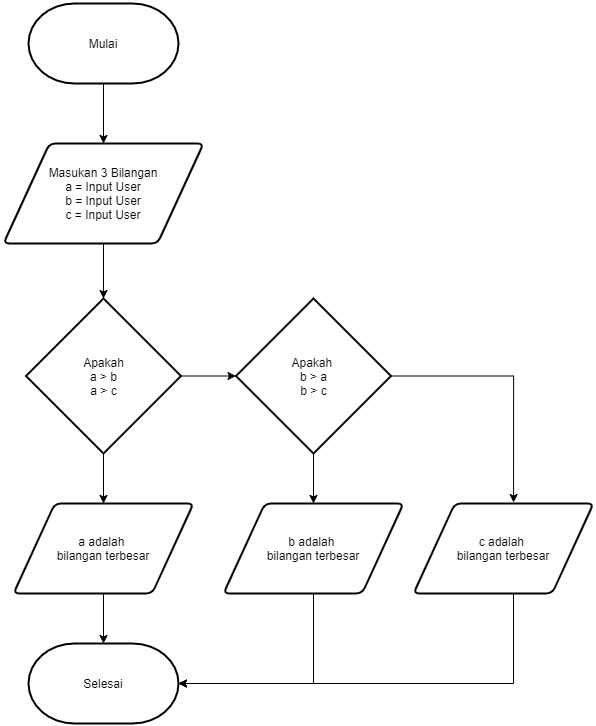

# Struktur Kondisi
# Iman Setiawan

**PDF Modul Praktikum - Tugas Praktikum 2**\
**Program Menampilkan Bilangan Terbesar**

Berikut adalah Flowchart dari code python yang akan saya buat.\

Ini adalah code pyhton saya\
Sangat sederhana, hanya menggunakan if dan elif.
~~~
#Program Menampilkan Bilangan Terbesar

#Input Bilangan
num1 = int(input("Masukan angka ke-1: "))
num2 = int(input("Masukan angka ke-2: "))
num3 = int(input("Masukan angka ke-3: "))

#Proses dan Output
if num1 > num2 and num1 > num3:
    print("Bilangan Terbesar Adalah :",num1)
elif num2 > num1 and num2 > num3:
    print("Bilangan Terbesar Adalah :", num2)
else:
    print("Bilangan Terbesar Adalah :", num3)
~~~

Dan ini adalah hasil output dari Program di atas:\
Kondisi 1, angka 1 adalah angka terbesar.\
Dengan input 3,2,1\
\
Kondisi 2, angka 2 adalah angka terbesar.\
Dengan input 1,3,2\
\
Kondisi 3, angka 3 adalah angka terbesar.\
Dengan input 3,2,1\

