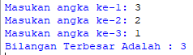
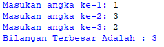
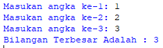

# Kondisional dan Perulangan Python
# Iman Setiawan

**PDF 07 Kondisional dan Perulangan - Lab 2 Latihan 1**\
**Program Menentukan Bilangan Terbersar**

Ini adalah code pyhton saya\
Sangat sederhana, hanya menggunakan if dan elif.\
Apabila input selain angka maka program akan berhenti.

~~~
#Program Menentukan Bilangan Terbersar

#Input Bilangan
num1 = input("Masukan angka ke-1: ")
num2 = input("Masukan angka ke-2: ")

#Proses dan Output
if num1 > num2:
    print(num1, "Adalah Bilangan Terbesar")
elif num2 > num1:
    print(num2, "Adalah Bilangan Terbesar")
else:
    print("Diluar dari pernyataan IF")

~~~

Dan ini adalah hasil output dari Program di atas.\

--------------------------------------------------------------

**PDF 07 Kondisional dan Perulangan - Lab 2 Latihan 2**\
**Program Mengurutkan Bilangan Sederhana**

Ini adalah code pyhton saya\
Saya menggunakan for in, range, dan variabel list untuk menyimpan bilangan.

~~~
#Program Mengurutkan Bilangan Sederhana
angka = list()
jumlah = input("Masukan Jumlah Bilangan: ")
for i in range(int(jumlah)):
    n = input("Masukan Bilangan :")
    angka.append(n)
    angka.sort()
print("Bilangan Berurutan: ",*angka, sep= " ")
~~~

Dan ini adalah hasil output dari Program di atas.\

--------------------------------------------------------------

**PDF 07 Kondisional dan Perulangan - Lab 3 Latihan 1**\
**Program Perulangan Bertingkat**

Ini adalah code pyhton saya\
Saya menggunakan for in, range dan merapihkan hasil nya.

~~~
#Program Perulangan Bertingkat
for i in range(10):
    for j in range(10):
       print('%2d'%(i + j), end=' ')
    print()
~~~

Dan ini adalah hasil output dari Program di atas.\

--------------------------------------------------------------

**PDF 07 Kondisional dan Perulangan - Lab 3 Latihan 2**\
**Program Menampilkan Bilangan Acak Kurang dari 0.5**

Ini adalah code pyhton saya\
Saya menggunakan for in, dan range

~~~
#Program Menampilkan Bilangan Acak Kurang dari 0.5

from random import random
n = int(input("Masukan Jumlah Bilangan :"))
for i in range(n):
        bil = random()%0.5
        print(bil)
~~~

Dan ini adalah hasil output dari Program di atas.\
